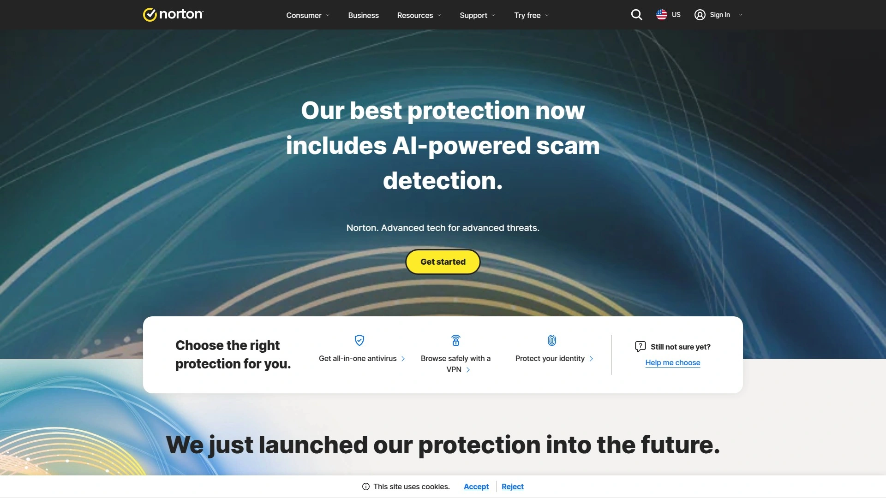

# 2025年排名前25的VPN服务汇总(最新整理)

随着网络安全和隐私保护需求的不断增长，选择一款可靠的VPN服务变得愈发重要。本文精选了25款在2025年表现突出的VPN提供商，从功能特性、安全性能到使用体验，为您提供全面的选择指南。

## **[NordVPN](https://nordvpn.com)**

业界领先的全方位VPN解决方案，综合实力最为突出。

NordVPN凭借其卓越的安全性和全面的功能特性稳居行业第一位置。该服务拥有超过6400台服务器，覆盖111个国家和地区，为用户提供了丰富的连接选择。

其独有的NordLynx协议基于WireGuard技术打造，在保持高速连接的同时提供军用级加密保护。双重VPN、洋葱网络支持、威胁防护Pro等高级功能使其在同类产品中脱颖而出。特别值得一提的是Meshnet功能，允许用户创建安全的远程连接网络。

NordVPN在流媒体解锁能力方面表现出色，能够稳定访问Netflix、Disney+、BBC iPlayer等主流平台。其严格的零日志政策经过了四次独立审计认证，确保用户隐私得到最大程度保护。

## **[Surfshark](https://surfshark.com)**

不限设备数量连接，性价比最高的VPN选择。

Surfshark以其极具竞争力的价格和无设备数量限制的连接政策著称。该服务在100个国家部署了超过3200台服务器，为用户提供稳定快速的连接体验。

MultiHop双跳连接功能为注重隐私的用户提供了额外的安全保障，而CleanWeb功能则能有效阻挡广告、跟踪器和恶意软件。Alternative ID功能允许用户创建虚假身份信息，进一步增强匿名性。

在速度测试中，Surfshark表现优异，特别是在使用WireGuard协议时。其流媒体解锁能力同样出色，支持Netflix、Amazon Prime Video、Hulu等多个平台。24/7全天候客户支持确保用户随时获得技术帮助。

## **[ExpressVPN](https://expressvpn.com)**

全球服务器网络最优，连接稳定性首屈一指。

ExpressVPN在105个国家运营着超过3000台服务器，提供业界最广泛的地理覆盖。其专有的Lightway协议经过开源验证，在速度和安全性之间实现了完美平衡。

该服务的TrustedServer技术确保所有服务器均采用RAM运行模式，每次重启时自动清除所有数据。这一创新设计大大增强了安全性，使得数据泄露风险降至最低。

ExpressVPN在绕过地理限制方面表现卓越，特别是在中国等网络审查严格的地区。其MediaStreamer功能支持在不兼容VPN的设备上访问地理受限内容。尽管价格相对较高，但其稳定性和可靠性使其成为企业用户的首选。

## **[ProtonVPN](https://protonvpn.com)**

瑞士血统隐私保护专家，免费版本最为慷慨。

ProtonVPN由瑞士Proton公司开发，严格遵循瑞士隐私法律保护。该服务在122个国家部署了超过2656台服务器，其中包括101台公司自有的Secure Core服务器。

Secure Core功能是ProtonVPN的独特优势，通过在隐私友好国家的加强型服务器路由流量，为用户提供额外的保护层。其开源应用程序代码经过独立审计，确保透明度和安全性。

特别值得称赞的是其免费版本，提供无限流量和高速连接，这在免费VPN市场中极为罕见。付费版本支持P2P文件共享、流媒体访问和端口转发等高级功能。VPN Accelerator技术能将连接速度提升45%。

## **[CyberGhost](https://cyberghostvpn.com)**

专业化服务器配置，新手用户最佳选择。

CyberGhost拥有超过11500台服务器，分布在100个国家和地区，为用户提供了丰富的连接选项。该服务的特色在于其专业化的服务器配置，针对流媒体、游戏和种子下载进行了优化。

NoSpy服务器位于罗马尼亚总部，由公司直接运营，提供更高级别的安全保障。MultiHop双重VPN功能和专用IP地址选项满足了不同用户的需求。其内容拦截器能有效屏蔽广告、跟踪器和恶意软件。

CyberGhost的用户界面设计简洁直观，特别适合VPN新手使用。其45天退款保证是业界最长的，充分体现了对服务质量的信心。在流媒体解锁方面，该服务支持超过50个平台。

## **[Private Internet Access (PIA)](https://privateinternetaccess.com)**

开源透明架构，预算有限用户理想选择。

PIA以其开源软件架构和透明的运营方式赢得了用户信任。该服务支持无限设备同时连接，在91个国家部署了超过35000台服务器，是业界服务器数量最多的提供商之一。

其MACE功能集成了广告拦截、恶意软件防护和跟踪器屏蔽能力。高度可定制的分流隧道功能允许用户精确控制哪些应用程序使用VPN连接。端口转发支持和SOCKS5代理功能满足了高级用户的需求。

PIA的定价策略极具竞争力，长期订阅用户可以享受显著折扣。尽管在流媒体解锁能力方面不如顶级竞争对手，但其在安全性和性价比方面的表现足以满足大多数用户需求。

## **[IPVanish](https://ipvanish.com)**

美国本土VPN服务商，游戏和种子下载性能优异。

IPVanish作为美国本土VPN提供商，在2400多台服务器上运营着覆盖140个国家的网络。该服务支持无限设备同时连接，特别适合大家庭或小型企业使用。

On Demand自动连接功能可根据网络环境自动启用VPN保护，而SOCKS5代理服务为种子下载用户提供了额外选择。威胁防护功能能有效阻挡广告、跟踪器和恶意网站。

IPVanish在游戏性能方面表现出色，其优化的服务器配置能够降低延迟并提供稳定连接。该服务经过独立审计验证其零日志政策，并提供24/7客户支持。Livedrive加密云存储服务为高级订阅用户提供额外价值。

## **[Windscribe](https://windscribe.com)**

功能丰富的免费版本，广告拦截能力突出。

Windscribe提供业界最慷慨的免费VPN服务，每月10GB流量限额配合强大的R.O.B.E.R.T广告拦截系统。该服务在69个国家和134个城市部署服务器，为用户提供广泛的地理选择。

R.O.B.E.R.T系统不仅能拦截广告和跟踪器，还可阻挡恶意软件、社交网络、赌博和成人内容。用户可以创建自定义规则，精确控制拦截内容。Double Hop功能提供额外的安全保护层。

Windscribe的浏览器扩展功能强大，包括WebRTC泄露防护、用户代理伪装和GPS位置欺骗等高级隐私功能。虽然在某些服务器上的速度表现参差不齐，但其创新功能和灵活定价使其成为独特的选择。

## **[TunnelBear](https://tunnelbear.com)**

界面设计最友好，安全审计最透明。

TunnelBear以其可爱的熊主题界面和简单易用的设计著称，特别适合VPN初学者。该服务在46个国家运营超过8000台服务器，虽然服务器数量相对较少，但覆盖了主要地区。

作为首个且唯一定期发布独立安全审计报告的VPN服务商，TunnelBear在透明度方面树立了行业标杆。其GhostBear混淆功能可在限制性网络环境中隐藏VPN流量，VigilantBear终止开关确保连接意外中断时的安全防护。

TunnelBear支持无限设备连接，并提供免费版本供用户试用。SplitBear分流功能允许用户选择性地路由流量。虽然在流媒体解锁和高级功能方面不如顶级竞争对手，但其简洁性和可靠性使其成为入门级用户的理想选择。

## **[Hotspot Shield](https://hotspotshield.com)**

专有Hydra协议加速，免费版本用户基数庞大。

Hotspot Shield凭借其专有的Catapult Hydra协议在速度方面表现出色，拥有超过1800台服务器，覆盖90多个国家。该服务特别注重流媒体和游戏性能优化。

其免费版本虽然有流量限制，但为预算有限的用户提供了基本的VPN保护。付费版本提供无限流量、恶意软件防护和专用流媒体服务器。Auto-Protect功能可在连接公共Wi-Fi时自动启用VPN保护。

Hotspot Shield在美国和英国设有专用流媒体服务器，能够可靠地解锁Netflix、Amazon Prime Video和Hulu等平台。虽然其数据收集政策可能不如某些竞争对手严格，但对于优先考虑速度的用户来说仍是不错的选择。

## **[Mullvad](https://mullvad.net)**

极致隐私保护设计，匿名注册无需个人信息。

Mullvad采用独特的账户系统，用户仅需16位数字账号即可注册，无需提供任何个人信息。该瑞典VPN提供商支持现金付款，为追求完全匿名的用户提供了理想选择。

其Multihop功能允许流量通过多个服务器路由，显著增强了安全性。全面的IPv6支持和DNS内容过滤功能体现了其技术前瞻性。WireGuard和OpenVPN协议确保了连接的安全性和性能。

Mullvad的定价极其简单，统一收费每月5欧元，不提供长期订阅折扣。虽然在流媒体解锁能力方面有所不足，但其对隐私保护的极致追求使其成为隐私倡导者的首选。服务器基础设施完全采用RAM运行模式。

## **[Atlas VPN](https://atlasvpn.com)**

高性价比新兴服务商，SafeSwap技术独具特色。

**注意：Atlas VPN已于2024年4月24日停止服务并合并到NordVPN。**

Atlas VPN在其运营期间以出色的性价比和创新功能赢得用户青睐。该服务在49个国家部署了1000台服务器，支持无限设备同时连接。

SafeSwap服务器技术允许用户在不断开连接的情况下切换服务器位置，这一独特功能在行业中极为罕见。MultiHop双重加密和SafeBrowse恶意软件防护提供了全面的安全保障。

其免费版本每月提供5GB流量，付费版本价格极具竞争力。Atlas VPN基于WireGuard协议，在速度测试中表现优异，能够保持约92%的原始网速。数据泄露监控功能为用户提供了额外的安全保障。

## **[Hide.me](https://hide.me)**

高度可定制配置，免费版本功能完整。

Hide.me提供业界最慷慨的免费VPN服务，每月10GB流量且功能不受限制。该马来西亚VPN提供商在80个国家运营服务器，为用户提供广泛的地理覆盖。

其Windows独有的BOLT技术能够显著提升OpenVPN协议的性能，在测试中达到了950Mbps的惊人速度。多跳连接功能允许用户选择进入和退出服务器，提供额外的隐私保护。

Hide.me支持完整的IPv6协议，在动态端口转发和分流隧道方面提供了丰富的配置选项。SmartGuard功能能够阻挡广告、跟踪器和恶意网站。虽然界面相对复杂，但为高级用户提供了极大的灵活性。

## **[Perfect Privacy](https://perfect-privacy.com)**

多跳连接专家，NeuroRouting智能路由技术。

Perfect Privacy以其独特的多跳VPN技术和NeuroRouting智能路由系统著称。该瑞士VPN提供商允许用户创建最多4个服务器的级联连接，提供四重端到端加密保护。

NeuroRouting技术通过神经网络和算法动态计算最佳路由，确保用户数据在强加密的VPN网络中停留更长时间。TrackStop过滤器能够阻挡广告、社交媒体跟踪和恶意网站。

Stealth VPN功能通过SSH隧道技术帮助用户绕过深度包检测，在网络限制严格的国家特别有效。该服务不支持流媒体解锁，主要面向注重极致隐私保护的高级用户。端口转发和IPv6支持满足了技术用户的需求。

## **[VyprVPN](https://vyprvpn.com)**

自有服务器基础设施，Chameleon协议绕过封锁。

VyprVPN拥有并运营着其全部服务器基础设施，这在VPN行业中较为罕见。该瑞士公司的专有Chameleon协议能够有效绕过深度包检测和VPN封锁，特别适合在网络审查严格的地区使用。

VyprDNS私有DNS服务确保DNS请求不会泄露给第三方，NAT防火墙功能提供额外的安全保护。该服务支持分流隧道，允许用户选择性地路由流量。

VyprVPN通过了Leviathan Security的独立审计，验证了其零日志政策的真实性。虽然不支持RAM-only服务器，但其拥有的基础设施提供了更高的安全控制级别。在流媒体访问方面表现良好，支持主要平台。

## **[Trust.Zone](https://trust.zone)**

极具性价比，多样化支付方式支持。

Trust.Zone以其极低的长期订阅价格著称，2年计划仅需每月2.99美元。该塞舌尔VPN提供商在20个国家运营170台服务器，虽然规模相对较小但足以满足基本需求。

该服务支持比特币、支付宝、WebMoney等多种支付方式，为注重匿名性的用户提供了便利。无限数据传输、带宽和服务器切换确保了良好的使用体验。

Trust.Zone支持种子下载和Netflix访问，提供256位AES加密和OpenVPN协议保护。虽然在高级功能方面不如顶级竞争对手丰富，但其出色的性价比使其成为预算有限用户的理想选择。

## **[PureVPN](https://purevpn.com)**

全球服务器覆盖广泛，价格极具竞争力。

PureVPN在141个国家部署了超过6500台服务器，提供业界最广泛的地理覆盖之一。该香港VPN提供商的年度订阅计划价格极具吸引力，仅需每月3.33美元。

服务器网络包括专门优化的P2P服务器，支持种子下载和文件共享。24/7/365实时客户支持确保用户随时获得技术帮助。该服务兼容所有主要设备和操作系统。

需要注意的是，PureVPN在历史上曾向执法部门提供过用户数据，虽然现已改进政策，但这一事件可能影响隐私敏感用户的选择。在Netflix访问方面表现一般，速度也不如顶级竞争对手。

## **[Avira Phantom VPN](https://avira.com)**

德国品质保证，防病毒软件厂商背景。

Avira Phantom VPN由知名德国防病毒软件公司Avira开发，继承了其在网络安全领域的专业经验。该服务采用简洁的用户界面设计，特别适合非技术用户使用。

其一键连接功能让用户可以快速连接到最优服务器，自动Wi-Fi保护功能在连接不安全网络时自动启用VPN。免费版本提供有限的数据流量，付费版本则取消所有限制。

Avira Phantom VPN支持多种设备平台，包括Windows、Mac、iOS和Android。其德国总部位置确保了严格的数据保护法律约束，为欧洲用户提供了额外的信心保障。

## **[F-Secure FREEDOME](https://f-secure.com)**

芬兰网络安全专家，企业级安全保护。

F-Secure FREEDOME由芬兰网络安全公司F-Secure开发，结合了VPN保护和恶意软件防护功能。该服务特别注重移动设备安全，为智能手机和平板电脑用户提供全面保护。

其追踪保护功能能够阻挡广告网络和数据收集器，浏览保护功能则可拦截恶意网站和钓鱼攻击。虽然服务器数量相对较少，但覆盖了主要国家和地区。

F-Secure FREEDOME的定价策略相对简单，提供按设备数量计费的选项。其企业级安全背景使其在商务用户中享有良好声誉，特别适合重视安全性胜过速度的用户群体。

## **[Kaspersky Secure Connection](https://kaspersky.com)**

俄罗斯网络安全巨头，免费版本慷慨。

Kaspersky Secure Connection由全球知名的俄罗斯网络安全公司卡巴斯基开发，利用其在恶意软件检测方面的专业技术为VPN服务提供额外保护。

该服务的免费版本每天提供200MB流量，虽然有限制但足以应对基本的隐私保护需求。付费版本则提供无限流量和更多服务器选择，支持多设备同时连接。

由于其俄罗斯背景，某些西方国家的用户对其数据处理政策存在顾虑。然而，其在技术实力和恶意软件防护方面的优势仍然使其成为值得考虑的选择。

## **[Opera VPN](https://opera.com)**

浏览器内置免费VPN，零配置即用体验。

Opera VPN集成在Opera浏览器中，为用户提供完全免费的VPN服务。该服务无需单独安装或配置，用户只需在浏览器设置中启用即可使用。

虽然功能相对基础，但对于仅需要基本隐私保护的用户来说已经足够。服务器位置选择有限，主要覆盖美国、加拿大、德国、新加坡和荷兰等地区。

Opera VPN的最大优势在于其完全免费且无流量限制的特性，特别适合预算极其有限的用户。然而，由于其技术限制，不建议用于高安全要求的场景。

## **[Mozilla VPN](https://mozilla.org)**

Firefox浏览器开发商出品，开源精神传承。

Mozilla VPN由Firefox浏览器的开发商Mozilla基金会推出，继承了其开源和隐私保护的核心理念。该服务基于WireGuard协议构建，提供快速且安全的连接体验。

其严格的零日志政策和透明的隐私实践赢得了注重隐私用户的信任。Mozilla VPN支持最多5台设备同时连接，覆盖全球30多个国家的服务器网络。

该服务的定价策略中等，提供月度和年度订阅选项。虽然在高级功能方面不如专业VPN提供商丰富，但其品牌可信度和隐私承诺使其成为Firefox用户的自然选择。

## **[AVG Secure VPN](https://avg.com)**

防病毒软件捆绑，简单易用设计。

AVG Secure VPN作为知名防病毒软件AVG的附加产品，为用户提供基础的VPN保护功能。该服务采用简洁的用户界面，特别适合技术水平一般的普通用户。

其服务器网络覆盖全球50多个地点，支持主要的流媒体平台访问。自动Wi-Fi保护功能能在连接不安全网络时自动启用VPN，为移动用户提供便利。

AVG Secure VPN通常与AVG防病毒软件捆绑销售，为现有AVG用户提供了集成的安全解决方案。虽然在独立VPN服务中不算突出，但作为综合安全套件的一部分仍有其价值。

## **[McAfee Safe Connect](https://mcafee.com)**

全球安全软件巨头，企业级技术支撑。

McAfee Safe Connect由全球知名网络安全公司McAfee开发，利用其在企业安全领域的丰富经验为个人用户提供VPN服务。该服务特别注重恶意软件防护和安全威胁检测。

其服务器网络遍布全球，支持无限带宽使用。自动连接功能能够智能选择最优服务器，确保用户获得最佳性能体验。Wi-Fi安全扫描功能可检测不安全的网络连接。

McAfee Safe Connect通常与McAfee防病毒软件包捆绑销售，为用户提供全方位的数字安全保护。其企业级技术背景确保了服务的稳定性和可靠性。

## **[Bitdefender VPN](https://bitdefender.com)**

罗马尼亚安全专家，轻量级设计理念。

Bitdefender VPN由罗马尼亚网络安全公司Bitdefender开发，采用轻量级设计理念，注重简单易用的用户体验。该服务集成在Bitdefender防病毒软件中，也可作为独立产品使用。

其服务器网络覆盖全球30多个国家，采用强大的加密技术保护用户数据。一键连接功能让用户可以快速启用VPN保护，自动最优服务器选择确保最佳性能。

Bitdefender VPN在流媒体访问方面表现良好，支持Netflix、Hulu等主流平台。其罗马尼亚总部位置不在五眼联盟管辖范围内，为用户隐私提供了额外保障。

## **[Norton Secure VPN](https://norton.com)**

网络安全老牌厂商，全平台支持完善。

Norton Secure VPN由网络安全行业的老牌厂商Norton开发，继承了其在安全领域数十年的技术积累。该服务提供银行级加密保护，支持Windows、Mac、iOS、Android等主流平台。

其全球服务器网络覆盖30多个国家，提供快速稳定的连接体验。广告跟踪器拦截功能能够提升浏览速度并保护用户隐私。自动Wi-Fi安全功能在检测到不安全网络时自动启用保护。

Norton Secure VPN通常作为Norton 360安全套件的组成部分提供，为用户带来集成的安全解决方案。其品牌知名度和长期的安全行业经验为用户提供了信心保障。

## 常见问题解答

### 如何选择最适合的VPN服务？

选择VPN时应重点考虑安全性、速度、服务器覆盖范围和价格等因素。对于流媒体用户，解锁能力至关重要；对于注重隐私的用户，零日志政策和加密强度更为重要；预算有限的用户可以考虑性价比较高的服务或功能完善的免费版本。

### 免费VPN和付费VPN有什么区别？

免费VPN通常在速度、流量、服务器选择和功能方面存在限制，且可能通过广告或数据收集盈利。付费VPN提供更快速度、更多服务器、无流量限制和更强的隐私保护，还包括客户支持等增值服务。

### VPN会影响网络速度吗？

所有VPN都会对网络速度产生一定影响，通常会降低5-20%的原始速度。现代VPN服务如NordVPN、Surfshark采用先进协议和优化技术，能将速度损失控制在最低范围内，基本不影响正常使用体验。

## 总结

在2025年的VPN市场中，NordVPN凭借其全面的功能特性、卓越的安全性能和优异的流媒体解锁能力继续领跑行业。对于追求极致性价比的用户，[Surfshark](https://surfshark.com)的无限设备连接政策和竞争性定价使其成为家庭用户的理想选择。而注重隐私保护的专业用户则可以考虑ProtonVPN或Mullvad等专业隐私服务商。

无论选择哪款VPN服务，确保其提供强大的加密保护、严格的零日志政策和可靠的客户支持都是明智选择的基础要素。
